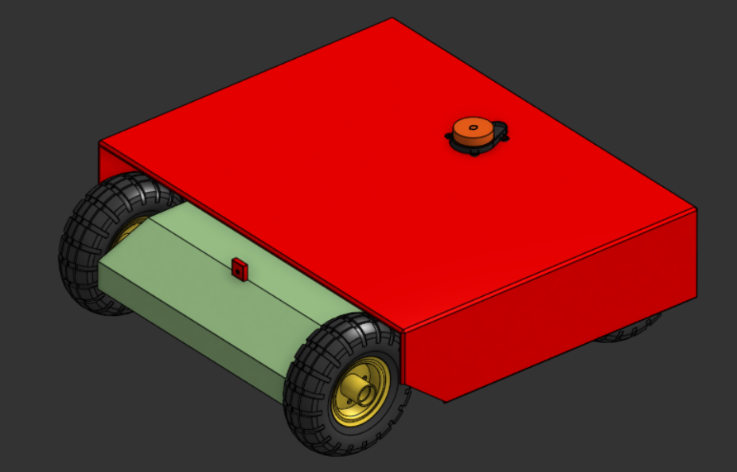
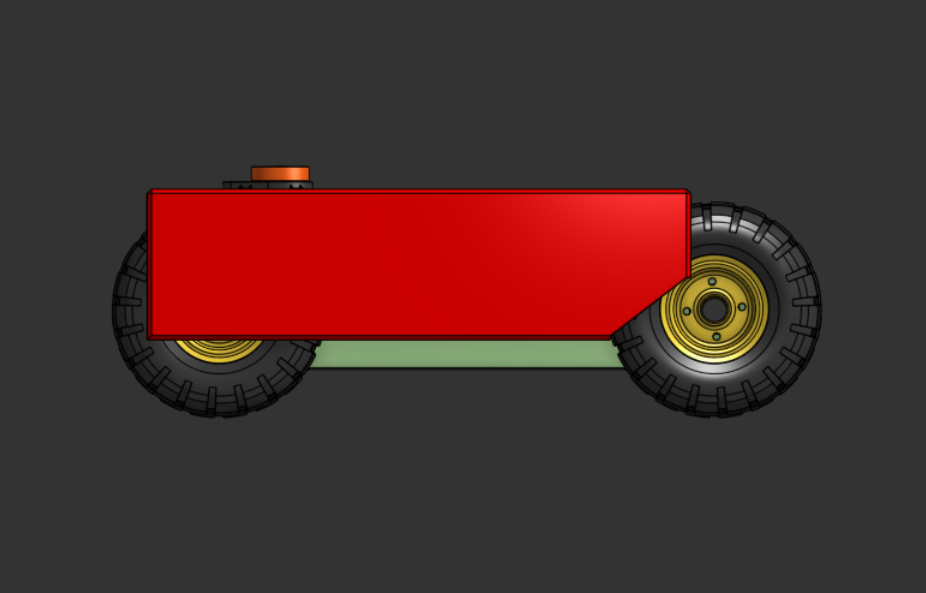
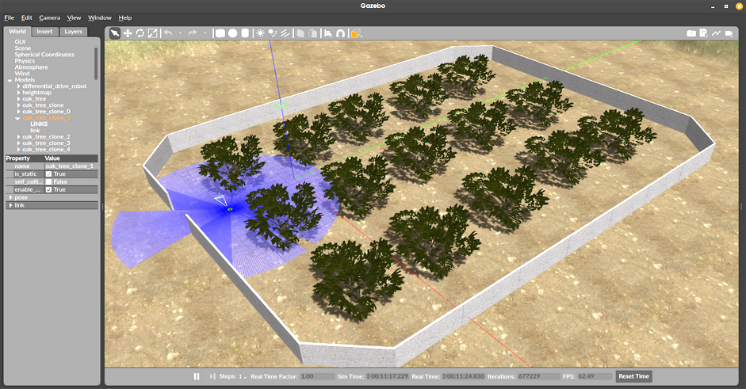
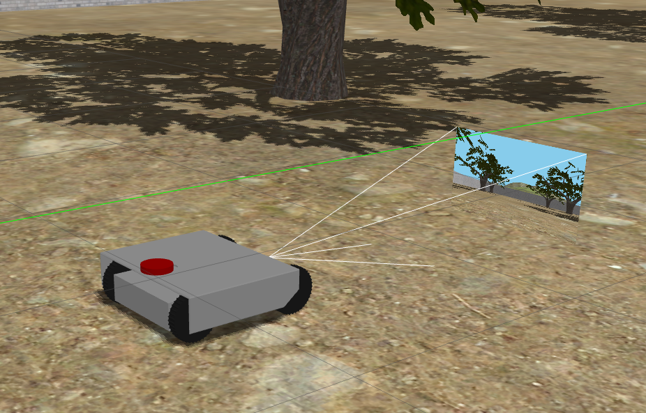
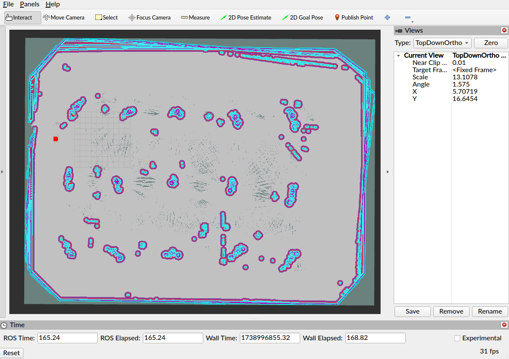

# 🤖 ***agro-bot*** A Differential Drive Robot in 3D Farm Simulation (ROS2) 🚜
###### Not so original name, sorry😅
## Overview 🌍

Hey there! This project is all about simulating a differential drive robot in a 3D farm environment using Gazebo. The goal? To get hands-on with ROS2, mapping, and autonomous navigation. Here's what's inside:

- **🌞 Gazebo**: A realistic 3D Farm environment created using a heightmap that imitates uneven surface of land.  
- **🗺️ SLAM Toolbox**: Used for mapping the farm environment.
- **🛠️ Nav2 Stack**: Still working on getting this running smoothly!
- **🛠️ Custom Robot Model**: Designed the robot body using Onshape and integrated it into Gazebo for visualization.

This project is just me experimenting and learning ROS2, so feel free to check it out on GitHub! 😃

## Installation & Setup 🏗️
1. Build the ROS2 workspace:
   ```bash
   colcon build --symlink-install
   source install/setup.bash
   ```
2. Clone the repository:
   ```bash
   cd ros_ws
   git clone git@github.com:ch374nvj/agro-bot.git src
   ```
3. Launch the Gazebo simulation:
   ```bash
   ros2 launch gazebo_env gazebo_model.launch.py
   ```
4. Run SLAM Toolbox:
   ```bash
   ros2 launch gazebo_env online_async_launch.py
   ```
   Using lidar and odom, map the entire area and save it using the slam_toolbox plugin in RViz.

5. Start the Navigation Stack (WIP):
   ```bash
   ros2 launch gazebo_env navigation_launch.py
   ```

6. Start Localization (WIP):
   ```bash
   ros2 launch gazebo_env localization_launch.py use_sim_time:=true map:=path/to/ros_ws/src/gazebo_env/maps/map.yaml
   ```
## Screenshots

|  |  |
| :----: | :----: |

<p align="center"> <i>Robot CAD Model</i> </p>


<p align="center"> <i>Gazebo simulation</i> </p>


<p align="center"> <i>Robot inside gazebo environment</i> </p>


<p align="center"> <i>RViz with map</i> </p>


## TODO ✅
- [x] 🚀 Complete Nav2 stack implementation
- [ ] 🎯 Tune navigation parameters for better path planning
- [ ] 🚧 Add obstacle avoidance mechanisms
- [ ] 🤖 Optimize robot control for smoother movement
- [ ] 🌾 Improve simulation environment and update Robot description () for realism

## Contributing 🙌
Want to help out? Open an issue or submit a pull request – any contributions are welcome! 😄
